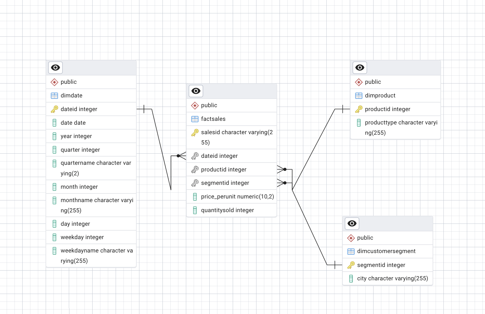

# Sales Data Warehouse - Star Schema 

## Overview
The Company sells various electronic products through its online and offline channels across major cities in the United States. They operate multiple stores and warehouses to manage their inventory and sales operations. The company wants to create a data warehouse to analyze its sales performance and inventory management and aims to generate reports, such as:

- Total sales revenue per year per city
- Total sales revenue per month per city
- Total sales revenue per quarter per city
- Total sales revenue per year per product category
- Total sales revenue per product category per city
- Total sales revenue per product category per store

## Tasks

1. **Create a Grouping Sets Query**  
   Use a `GROUPING SETS` query to generate specific combinations of aggregations, providing flexibility for customized grouping in the report.

2. **Create a Rollup Query**  
   Implement a `ROLLUP` query to get cumulative subtotals along with the grand total for hierarchical data (e.g., sales per year, month, quarter).

3. **Create a Cube Query**  
   Leverage a `CUBE` query to create a multidimensional summary for the data, offering a full combination of all possible groupings for the report metrics.

4. **Create a Materialized View**  
   Build a `MATERIALIZED VIEW` for precomputed summaries that enhance performance when querying frequently accessed aggregated data.

## Star Schema ERD
The star schema used for the data warehouse is illustrated below:

